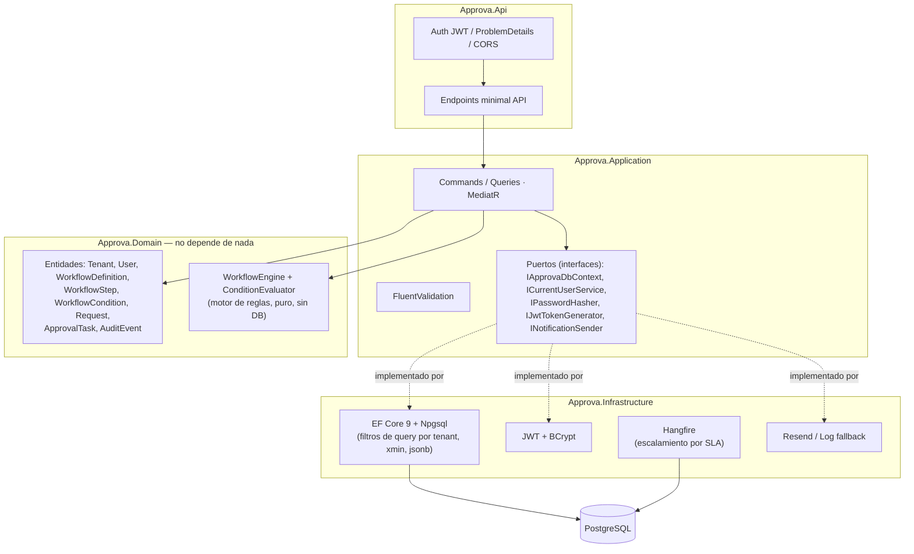
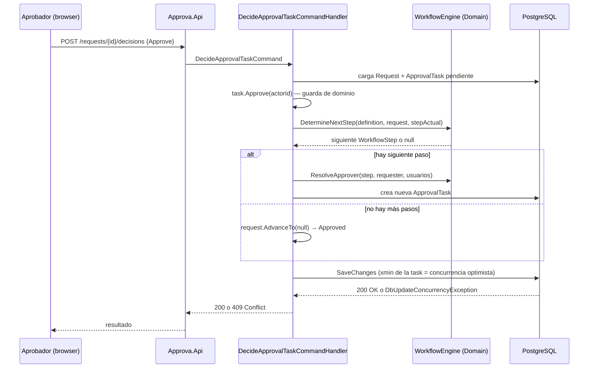
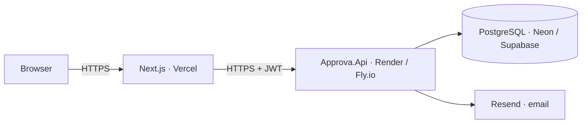

# Arquitectura

## Capas (Clean Architecture)

Regla que no se rompe: **Domain no importa nada de Application, Infrastructure ni Api.**
El motor de reglas (`WorkflowEngine` + `ConditionEvaluator`) es texto plano de C# que
recibe un `Request` y una `WorkflowDefinition` en memoria y devuelve el siguiente paso —
se prueba con 38 tests unitarios sin levantar Postgres.

## Flujo de una decisión (el camino feliz)

## Despliegue (objetivo, ver README para estado actual)

## Por qué estas decisiones

- **Reglas como datos, no como código.** `WorkflowDefinition` → `WorkflowStep` →
  `WorkflowCondition` viven en Postgres. `WorkflowEngine.DetermineNextStep` las recorre en
  orden y evalúa condiciones con semántica AND. Cambiar "compras sobre $5,000 requieren
  CFO" es un `INSERT`, no un despliegue — verificable en vivo: `POST /workflow-definitions`.
- **Concurrencia optimista, no locks.** `ApprovalTask.RowVersion` está mapeado al sistema
  `xmin` de Postgres. Dos aprobadores decidiendo la misma tarea al mismo tiempo: uno gana
  (200), el otro pierde con `DbUpdateConcurrencyException` → 409 Conflict. Nunca hay doble
  procesamiento silencioso. Probado con dos requests HTTP simultáneas reales
  (`ConcurrencyTests.TwoSimultaneousApprovals_OneSucceedsOneConflicts`).
- **Auditoría append-only, reforzada dos veces.** `AuditEvent` no expone ningún método de
  modificación en el dominio, y `ApprovaDbContext.SaveChanges` rechaza explícitamente
  cualquier `EntityState.Modified` o `Deleted` sobre esa tabla — incluso si algún código
  futuro se equivoca.
- **Aislamiento multi-tenant por defecto, no por disciplina.** Filtro de query global en EF
  Core (`HasQueryFilter`) sobre `User`, `WorkflowDefinition`, `Request` y `AuditEvent`, atado
  al tenant del JWT actual. El único lugar donde se ignora a propósito (`IgnoreQueryFilters`)
  es el login (todavía no hay tenant resuelto) y el job de escalamiento por SLA (es
  intencionalmente cross-tenant). Probado con tests de integración reales contra Postgres
  (Testcontainers) que crean dos tenants y confirman que uno no puede leer al otro.

## Qué haría diferente

- **Semántica de condiciones más rica.** Hoy cada paso evalúa sus condiciones con AND
  puro. Un árbol de expresiones con OR/NOT sería el siguiente paso natural — lo dejé fuera
  de la v1 a propósito: es la abstracción correcta solo cuando aparece un segundo caso de
  uso real que la necesite.
- **Seed data con más variedad temporal.** Los timestamps del seed están "back-dateados"
  con latencias realistas por paso (ver `DbSeeder`), pero siguen siendo determinísticos
  (`Random` con semilla fija). Para un demo de producción real, generaría un dataset con
  distribución más orgánica (picos de fin de mes, fines de semana sin actividad).
- **Idempotencia bajo concurrencia real.** La implementación actual de `Idempotency-Key`
  cubre el caso común (reintento secuencial tras timeout) pero no una carrera perfecta
  entre dos requests idénticas simultáneas — ahí ganaría la primera y la segunda vería un
  409 en vez del resultado cacheado. Un lock distribuido o un "reservar la key primero"
  lo resolvería, a costa de una vuelta más a la base de datos en el camino feliz.
